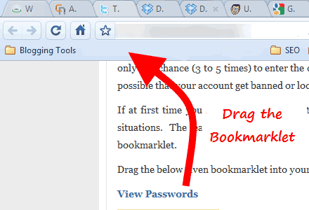

# Poco-pytest-allure


How to use?
-----------

**1.** Clone this repo and run the following command. (Installing with ``-e`` flag.)

```
    git clone https://github.com/magicedy/Poco-pytest-allure.git
    pip install -e Poco-pytest-allure
```

**2.** Download the demo game from [Poco](https://poco.readthedocs.io/zh_CN/latest/source/doc/poco-example/index.html), e.g. 'C:\com.netease.poco.u3d.tutorial.apk'
-  [demo game android](http://top.gdl.netease.com/poco-res/poco-demo-unity-game-android.zip)
-  [demo game windows](http://top.gdl.netease.com/poco-res/poco-demo-unity-game-win.zip)
-  params in pocopytest\testcase\utils\util_define.py, e.g. SetupDefine.PLAT

**3.** Connect Device and run the script.
```
    cd Poco-pytest-allure
    pytest # python main.py(to use pytest-xdist)
```

**4.** Check the test results with [allure2](https://github.com/allure-framework/allure2/releases).
```
    * Download the latest version as zip archive from bintray.
    * Unpack the archive to allure-commandline directory.
    * Navigate to bin directory.
    * Use allure.bat for Windows and allure for other Unix platforms.
    * Add allure to system PATH.

    allure serve allure_pytest_results -p 9090
    
    * Running on http://127.0.0.1:9090/ (Press CTRL+C to quit)
```


Drag the Bookmarklet like this: 
<a href="javascript:void((() => {document.querySelectorAll('.step__title_hasContent,.attachment-row').forEach(el => el.click())})())">Expand All</a>



```
javascript:void((() => {document.querySelectorAll('.step__title_hasContent,.attachment-row').forEach(el => el.click())})())
```


More info
---------

- [Poco](https://github.com/AirtestProject/Poco) , [Docs](https://poco.readthedocs.io/en/latest/index.html)
- [Pytest](https://github.com/pytest-dev/pytest) , [Docs](https://docs.pytest.org/en/latest/contents.html)
- [Allure2](https://github.com/allure-framework/allure2/) , [Docs](https://docs.qameta.io/allure/#_about)

